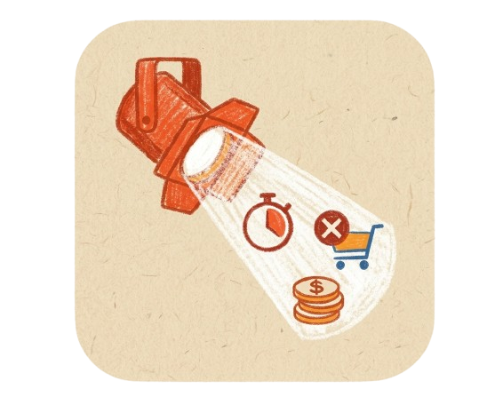

# Deflector

<p align="center">
  
</p>

**AI working for you, not against you.**

Deflector is a Chrome extension that spots pressure tactics on shopping and booking pages — urgency timers, fake scarcity, trick questions, hidden costs — and explains them in plain language.

It’s the commerce-page cousin of [Imbue Bouncer](https://imbue.com/product/bouncer). Bouncer filters your feed. Deflector marks up the page you’re trying to buy from.

<p align="center">
  
</p>

---

## Why use it

Sites are built to rush you. “Only 2 left.” “Sale ends in 09:42.” “47 people viewing this.” Often that language is designed — sometimes personalized — to push a decision before you’ve had one.

Deflector runs **for you**, not the platform. It highlights what looks like pressure, tells you why, and suggests a calmer way to read the same claim. No account. No sync. No telemetry. Your data stays in your browser unless you opt into deep scan.

Same idea as [Imbue’s vision](https://imbue.com/): tools should be loyal to the person using them.

---

## What it catches

- **Urgency** — countdowns, “last chance,” expiring offers  
- **Scarcity** — “only X left,” low-stock nudges  
- **Social proof** — fake activity, popularity claims  
- **Hidden cost** — fees that appear late in checkout  
- **Trick questions** — confusing opt-in/out, pre-checked boxes  
- **Misdirection** — shaming decline buttons  
- **Disguised ads** — paid content dressed as recommendations  

---

## How it works

**1. Knows when to look**  
Deflector scores each page (URL, product signals, checkout cues). On shopping surfaces it scans automatically. Elsewhere it waits until you ask.

**2. Rules first**  
~40 text patterns from [Princeton’s dark-patterns research](https://webtransparency.cs.princeton.edu/dark-patterns/), plus structural checks (timers, pre-checked consent, disguised ads) and site rules for Amazon and Booking.com. Fast, offline, no API key needed.

**3. Optional deep scan**  
Turn on AI escalation in the popup if you want a second pass on ambiguous lines. Uses your Anthropic key, only when enabled, only for uncertain snippets.

When something matches, Deflector draws a ring around the text and opens a sidebar with the quote, a short explanation, and a plain-language alternative.

---

## Get started

```bash
git clone <this-repo>
cd deflector
npm install
npm run build
```

1. Open `chrome://extensions`  
2. Enable **Developer mode**  
3. **Load unpacked** → select the `deflector/` folder  
4. Visit a product, checkout, or booking page  

After code changes: `npm run build`, then **Reload** on the extension card.

---

## Your first scan

**On the page**  
A logo button sits on the right edge. Tap it to open the panel.

**In the panel**  
See every finding grouped by type. Tap one to jump to it on the page. Change scan mode or rescan from **Settings** at the bottom.

**In the popup**  
Click the extension icon for a quick count, category breakdown, scan settings, and (optional) API key for deep scan.

**Other ways in**  
Right-click → **Deflector: Scan this page** or **Scan selection**  
Keyboard: `Alt+Shift+D` (set at `chrome://extensions/shortcuts`)

**Scan modes (per site)**  
Auto on shopping pages · Manual only · Every page load · Off

---

## What’s next

- [ ] Local model via WebLLM (like Bouncer — fully on-device)  
- [ ] Firefox support  
- [ ] “This was wrong” feedback  
- [ ] Export findings as a report  
- [ ] Community filter lists  

---

## For builders

| Doc | What’s in it |
|---|---|
| [PRODUCT.md](PRODUCT.md) | Purpose, users, voice |
| [DESIGN.md](DESIGN.md) | Visual system |
| [CLAUDE.md](CLAUDE.md) | Agent / contributor notes |

**Stack:** MV3 extension · filter lists + DOM heuristics · optional Claude Haiku escalation · esbuild bundle  

**Cost:** $0 by default. Deep scan only if you add a key and enable it.

---

## Philosophy

Recommendation feeds aren’t the only place AI works against you. Checkout pages, booking flows, and product listings use the same playbook — pressure, personalization, fine print.

Deflector is a small countermeasure: honest annotation on a hostile surface. Not a blocker. Not an alarm. A mark-up from something on your side.

Built in the spirit of [Imbue](https://imbue.com) — **honest software in your control.**
